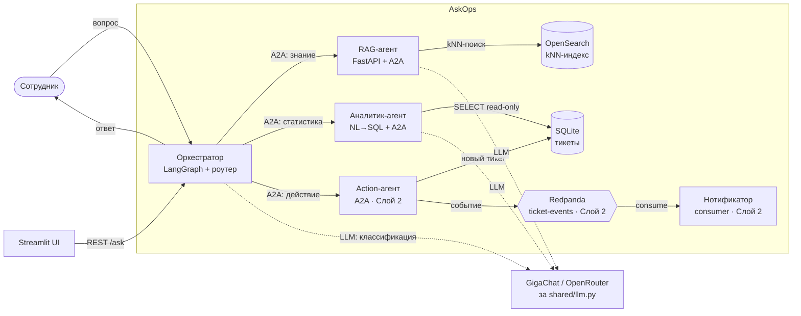

# AskOps — помощник первой линии ИТ-поддержки

AskOps — мини-помощник из **команды агентов**, которые общаются по протоколу **A2A**.
Оркестратор маршрутизирует вопрос нужному специалисту: на знание («как настроить
VPN») отвечает **RAG-агент** (kNN-поиск в OpenSearch + LLM), на статистику
(«сколько инцидентов по доступам за май») — **аналитик-агент** (безопасный NL→SQL
по базе тикетов). Весь стек поднимается одной командой `docker compose up`.

> **V1** — фундамент (оркестратор + RAG). **Слой 1** добавил аналитик-агента и
> настоящую маршрутизацию. **Слой 2** — action-агента, очередь событий (Redpanda)
> и нотификатора (поднимается профилем `--profile action`). Остальная дорожная
> карта (k3d/Helm/ArgoCD, мониторинг) — в конце README.

## Какую задачу решает

Первая линия поддержки тонет в типовых вопросах («не работает VPN», «как получить
доступ к Jira», «забыл пароль»), ответы на которые уже лежат в вики — но туда никто
не заходит. AskOps отвечает на такие вопросы мгновенно и человеческим языком,
опираясь на ту же базу знаний, и **честно говорит «не знаю»**, когда ответа в базе
нет (ничего не выдумывает).

Подробное описание задачи, пользователя и границ V1 — в [docs/PROBLEM.md](docs/PROBLEM.md).

## Архитектура



- **Оркестратор** (LangGraph + FastAPI) — точка входа. Узлом-**роутером**
  классифицирует интент (LLM + запасное правило по ключевым словам) и по **A2A**
  вызывает нужного специалиста: знание → RAG, статистика → аналитик, действие →
  action.
- **RAG-агент** (FastAPI + A2A-сервер) — «мозг знаний». Делает kNN-поиск в
  OpenSearch, собирает контекст и просит LLM ответить **строго по контексту**.
- **Аналитик-агент** (FastAPI + A2A-сервер) — «мозг цифр». Генерирует SQL по
  вопросу (NL→SQL) и **безопасно** выполняет его по базе тикетов: только `SELECT`,
  read-only коннект, валидация запроса. Произвольный SQL от модели не исполняется.
- **Action-агент** *(Слой 2)* — «агент, который делает». Создаёт тикет в базе и
  публикует событие в очередь.
- **Нотификатор** *(Слой 2)* — consumer очереди: ловит событие и шлёт уведомление
  (консоль + файл + REST `/notifications`).
- **OpenSearch** — поисковый движок с kNN (база знаний RAG).
- **SQLite** — синтетическая база тикетов (читает аналитик, пишет action).
- **Redpanda** *(Слой 2)* — Kafka-совместимый брокер, топик `ticket-events`.

Подробнее (взаимодействие по A2A, поток данных) — в [docs/ARCHITECTURE.md](docs/ARCHITECTURE.md).

## Стек технологий

| Слой | Технология |
| --- | --- |
| Оркестрация и маршрутизация | LangGraph (роутер: LLM + ключевые слова) |
| Межагентный протокол | A2A (`a2a-sdk`) |
| Веб-сервисы | FastAPI + Uvicorn |
| Поиск (RAG) | OpenSearch (kNN, `opensearch-py`) |
| Эмбеддинги | sentence-transformers (локально, офлайн) |
| Аналитика | NL→SQL по SQLite (только SELECT, read-only, валидация) |
| Синтетические данные | Faker (база тикетов хелпдеска) |
| Очередь событий (Слой 2) | Redpanda (Kafka-совместимый), `kafka-python` |
| Деплой (Слой 3) | Helm-чарт + ArgoCD (GitOps), образы в GHCR |
| Мониторинг (Слой 4) | Prometheus + Grafana, `prometheus-fastapi-instrumentator` |
| LLM | GigaChat или OpenRouter (напр. DeepSeek V4 Flash) — за абстракцией `shared/llm.py` |
| UI (демо) | Streamlit |
| Упаковка | Docker Compose |
| CI | GitHub Actions (ruff + pytest + сборка/пуш образов в GHCR) |

## Быстрый старт (Docker Compose)

```bash
# 1. Настроить переменные окружения
cp .env.example .env
#    впиши GIGACHAT_CREDENTIALS (с developers.sber.ru),
#    либо поставь LLM_MODE=mock, чтобы поднять стек без кредов GigaChat.

# 2. Поднять весь стек
docker compose up --build
```

### Выбор LLM-провайдера

LLM спрятан за `shared/llm.py` (`ask_llm`), провайдер переключается через
переменные окружения — код менять не нужно:

```bash
# Вариант А — GigaChat (по умолчанию)
LLM_PROVIDER=gigachat
GIGACHAT_CREDENTIALS=<ключ с developers.sber.ru>

# Вариант Б — OpenRouter с DeepSeek V4 Flash
LLM_PROVIDER=openrouter
OPENROUTER_API_KEY=<ключ с openrouter.ai/keys>
OPENROUTER_MODEL=deepseek/deepseek-v4-flash   # можно любую модель OpenRouter

# Вариант В — без кредов вообще (заглушка, для проверки пайплайна)
LLM_MODE=mock
```

Запуск с DeepSeek одной командой (значения берутся из `.env` или из окружения):

```bash
LLM_PROVIDER=openrouter OPENROUTER_API_KEY=sk-or-... docker compose up --build
```

Поднимутся пять сервисов: `opensearch`, `rag` (при первом старте сам
проиндексирует базу знаний), `analyst` (при первом старте сгенерирует базу
тикетов), `orchestrator` и `ui`. Данные лежат в именованных volume.

Когда всё поднялось:

```bash
# Вопрос на знание → оркестратор по A2A сходит в RAG-агента
curl -s http://localhost:8000/ask \
  -H 'Content-Type: application/json' \
  -d '{"question": "не подключается VPN с домашнего ноутбука"}'

# Вопрос про статистику → оркестратор по A2A сходит в аналитик-агента
curl -s http://localhost:8000/ask \
  -H 'Content-Type: application/json' \
  -d '{"question": "сколько инцидентов по доступам за последний месяц"}'
```

Или открой демо-страницу: <http://localhost:8501>.

Порты: оркестратор `8000`, RAG-агент `8001`, аналитик-агент `8002`,
OpenSearch `9200`, UI `8501`. Со Слоем 2 добавляются action-агент `8003`,
нотификатор `8004`, Redpanda `19092`.

### Слой 2: действия и события (профиль `action`)

Action-агент, очередь (Redpanda) и нотификатор поднимаются отдельным профилем,
чтобы не держать Kafka постоянно:

```bash
docker compose --profile action up --build

# Запрос-действие → action-агент создаёт тикет, публикует событие в очередь,
# нотификатор ловит его и «уведомляет» (консоль + файл + /notifications)
curl -s http://localhost:8000/ask \
  -H 'Content-Type: application/json' \
  -d '{"question": "создай заявку на доступ к боевой БД"}'

# Посмотреть, что поймал нотификатор:
curl -s http://localhost:8004/notifications
```

Цепочка событийная и асинхронная: ответ пользователю возвращается сразу после
создания тикета, а нотификатор обрабатывает событие из очереди независимо.
**Надёжность:** если очередь недоступна, тикет всё равно создаётся, а в ответе
честно указано, что событие не ушло.

### Слой 4: метрики и дашборд (профиль `observability`)

Агенты отдают `/metrics`, Prometheus их собирает, Grafana показывает дашборд
(латентность, RPS по агентам, ошибки, вызовы LLM и расход токенов):

```bash
docker compose --profile observability up --build
# Prometheus → http://localhost:9090   Grafana → http://localhost:3000 (admin/admin)
```

Дашборд «AskOps — агенты» провижинится автоматически. Подробности —
[docs/OBSERVABILITY.md](docs/OBSERVABILITY.md).

## Локальный запуск (без Docker)

```bash
python -m venv .venv && source .venv/bin/activate
pip install -r requirements.txt
cp .env.example .env   # для локалки выстави OPENSEARCH_HOST=localhost, RAG_AGENT_URL=http://localhost:8001

# OpenSearch удобнее всё равно поднять контейнером:
docker compose up -d opensearch

python -m agents.rag.indexer                                   # индексация БЗ
python -m agents.analyst.generate_tickets                      # генерация базы тикетов
uvicorn agents.rag.app:app --port 8001                         # RAG-агент
uvicorn agents.analyst.app:app --port 8002                     # аналитик-агент (отд. терминал)
uvicorn agents.orchestrator.app:app --port 8000               # оркестратор (отд. терминал)
streamlit run ui/streamlit_app.py                              # UI (опционально)
```

> Для локалки в `.env` выстави `TICKETS_DB_PATH=data/tickets.db`,
> `ANALYST_AGENT_URL=http://localhost:8002` и `RAG_AGENT_URL=http://localhost:8001`.

## Примеры диалогов

| Вопрос | Маршрут | Ожидаемый ответ |
| --- | --- | --- |
| Не подключается VPN с домашнего ноутбука | RAG | Шаги из инструкции по VPN (GlobalProtect, MFA, переустановка) |
| Как получить доступ к Jira? | RAG | Процедура заявки на ServiceDesk |
| Забыл пароль от корпоративной почты | RAG | Шаги восстановления через `id.company.ru` / ServiceDesk |
| Какой VPN-клиент ставить на Mac? | RAG | GlobalProtect для macOS |
| Как работает телепортация? | RAG | Честное «в базе знаний нет информации» |
| Сколько инцидентов по доступам за последний месяц? | Аналитик | Число из базы тикетов + показанный SQL |
| Среднее время решения по приоритетам | Аналитик | Сводка по `resolution_minutes` в разрезе приоритетов |
| Создай заявку на доступ к боевой БД | Action (Слой 2) | Создан тикет `REQ-…`, событие в очереди, уведомление |

RAG-пары — эталонный набор для проверки качества (см. [docs/PROBLEM.md](docs/PROBLEM.md));
аналитические показывают работу маршрутизации и NL→SQL.

## Тесты и линт

```bash
pip install -r requirements-dev.txt
ruff check .
LLM_MODE=mock pytest
```

Тесты гоняют LLM в mock-режиме и мокают поиск/эмбеддинги — тяжёлые модели не
качаются, сеть не нужна. На каждый push GitHub Actions выполняет линт, тесты и
сборку Docker-образов (см. [.github/workflows/ci.yml](.github/workflows/ci.yml)).

## Структура репозитория

```
askops/
├── docs/
│   ├── PROBLEM.md            # описание задачи и примеры диалогов
│   ├── ARCHITECTURE.md       # архитектура и взаимодействие по A2A
│   └── knowledge_base/       # ~20 markdown-документов базы знаний
├── shared/
│   ├── llm.py                # абстракция над GigaChat (ask_llm)
│   ├── embeddings.py         # эмбеддинги (sentence-transformers)
│   └── config.py             # конфиг из переменных окружения
├── agents/
│   ├── orchestrator/         # LangGraph + роутер + A2A-клиент + REST /ask
│   ├── rag/                  # RAG: индексатор, поиск, A2A-сервер
│   ├── analyst/              # NL→SQL по тикетам (генератор, безопасный SQL, A2A)
│   ├── action/               # Слой 2: создание тикетов + публикация в Kafka
│   └── notifier/             # Слой 2: consumer очереди → уведомления
├── ui/                       # Streamlit-демо
├── deploy/                   # Слой 3: helm/ + argocd/ · Слой 4: observability/
├── tests/                    # pytest
├── docker-compose.yml
└── .github/workflows/ci.yml
```

## Дорожная карта (за пределами V1)

Каждый пункт — отдельный уровень, который добавляется, только когда предыдущий
стабильно работает:

- ✅ **Слой 1 — Аналитик-агент + настоящая маршрутизация** *(сделано)*: второй
  специалист (NL→SQL по тикетам, безопасный read-only SELECT) и роутер, который
  реально выбирает между RAG и аналитиком.
- ✅ **Слой 2 — Action-агент + Kafka** *(сделано)*: action-агент создаёт тикеты и
  публикует события в очередь (Redpanda); агент-нотификатор слушает топик.
  Асинхронная событийная цепочка поверх A2A. Профиль `--profile action`.
- ✅ **Слой 3 — k3d + Helm + ArgoCD** *(артефакты готовы)*: Helm-чарт
  (`deploy/helm/askops`), ArgoCD Application (`deploy/argocd`), CI пушит образы в
  GHCR. Деплой по GitOps — см. [docs/DEPLOY.md](docs/DEPLOY.md).
- ✅ **Слой 4 — Prometheus + Grafana** *(сделано)*: агенты отдают `/metrics`
  (латентность, RPS, ошибки, вызовы LLM и расход токенов), Prometheus собирает,
  Grafana показывает дашборд. Профиль `--profile observability` — см.
  [docs/OBSERVABILITY.md](docs/OBSERVABILITY.md).

Подробности уровней — в [PLAN2.md](PLAN2.md).

## Конфигурация

Все настройки — через переменные окружения (см. [.env.example](.env.example)).
Ключевые:

| Переменная | Назначение |
| --- | --- |
| `LLM_MODE` | `real` (реальный провайдер) или `mock` (заглушка без сети) |
| `LLM_PROVIDER` | `gigachat` или `openrouter` (при `LLM_MODE=real`) |
| `GIGACHAT_CREDENTIALS` | Authorization key с developers.sber.ru |
| `OPENROUTER_API_KEY` | Ключ с openrouter.ai/keys |
| `OPENROUTER_MODEL` | Модель OpenRouter, по умолчанию `deepseek/deepseek-v4-flash` |
| `EMBEDDING_MODEL` / `EMBEDDING_DIM` | Модель эмбеддингов и размерность вектора |
| `OPENSEARCH_HOST` / `OPENSEARCH_PORT` / `OPENSEARCH_INDEX` | Подключение к OpenSearch |
| `RAG_AGENT_URL` | URL RAG-агента для A2A-клиента оркестратора |
| `RAG_TOP_K` | Сколько кусков подмешивать в контекст |
| `ANALYST_AGENT_URL` | URL аналитик-агента для A2A-клиента оркестратора |
| `TICKETS_DB_PATH` | Путь к SQLite-базе тикетов (аналитик читает её read-only) |
| `ANALYST_MAX_ROWS` | Лимит строк в результате сгенерированного SELECT |
| `TICKETS_COUNT` | Сколько синтетических тикетов сгенерировать при первом старте |
| `ACTION_AGENT_URL` | URL action-агента (Слой 2) для A2A-клиента оркестратора |
| `KAFKA_BOOTSTRAP_SERVERS` / `KAFKA_TOPIC` | Брокер Redpanda и топик событий (Слой 2) |
| `NOTIFICATIONS_FILE` | Куда нотификатор пишет уведомления (Слой 2) |
